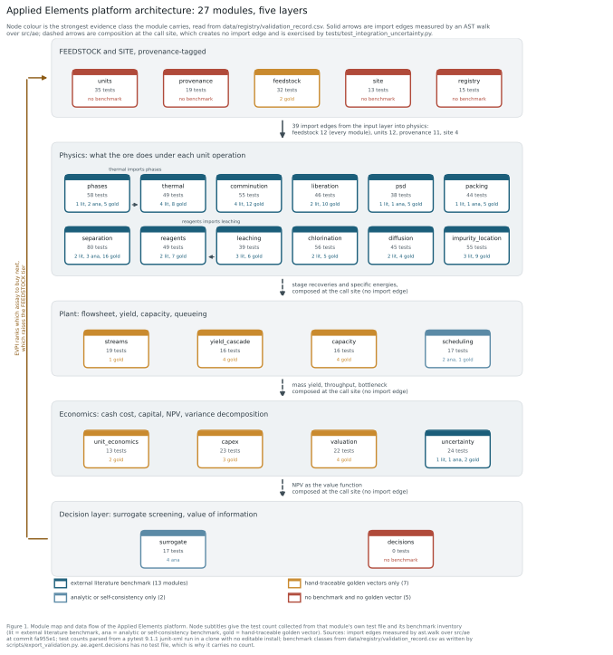

# PLAN: architecture of the Applied Elements platform

Measured at commit `fbefb47`. Every count in this file was produced by a command
run in this repository, named beside the number. Nothing here is recalled.

`src/ae` holds 27 modules and 17,259 source lines (`find src/ae -name '*.py' !
-name '__init__.py' | xargs wc -l`). The suite collects 1,733 tests
(`pytest tests/ --junitxml`, parsed).

Figure 1. Module map and data flow. Node colour is the strongest evidence class
the module carries. Solid arrows are import edges measured by an AST walk over
`src/ae`; dashed arrows are composition at the call site, which creates no import
edge. Vector source: `docs/figures/architecture.svg`, raster:
`docs/figures/architecture.png`.

## The layering, and why it is not enforced by imports

The five layers are a reading order, not a package boundary. Measured with
`ast.walk` over every non-`__init__` module in `src/ae`, there are 57 internal
import edges, distributed as follows:

| edge direction | count |
| --- | --- |
| inputs to physics | 39 |
| inputs to inputs | 7 |
| inputs to econ | 6 |
| inputs to plant | 3 |
| physics to physics | 2 |
| physics to plant | 0 |
| plant to econ | 0 |
| econ to decision | 0 |

The last three rows carry the architectural weight. **Physics does not import
plant, plant does not import econ, and econ does not import the decision layer.**
Those three couplings exist only as composition at a call site, and the call site
that exercises all of them is `tests/test_integration_uncertainty.py`, whose
`plant_npv()` chains `cascade_yield`, `off_spec_fraction`, `Project`,
`cash_flows`, `npv` and `breakeven_price` into one function of the sampled
inputs.

The consequence for anyone extending the platform: a new physics model becomes
visible to the economics only when someone writes the composition. There is no
framework that will pick it up. The corresponding benefit is that each layer is
independently testable and independently wrong.

Fan-out, same measurement, counted as edges out of each module:

| module | modules importing it |
| --- | --- |
| `ae.core.units` | 21 |
| `ae.core.provenance` | 16 |
| `ae.core.feedstock` | 12 |
| `ae.core.site` | 6 |
| `ae.physics.leaching` | 1 |
| `ae.physics.phases` | 1 |

`units` and `provenance` are the two modules that can break everything. `units`
defines the single shared `pint` registry; two registries in one process make
every cross-model quantity comparison raise. `provenance` defines the `Tag` and
`Tier` enums and the `Source` validators, so a change to what counts as an
acceptable citation propagates to 16 modules at import time.

The only two physics-internal import edges are
`ae.physics.reagents` importing `ae.physics.leaching` and
`ae.physics.thermal` importing `ae.physics.phases`. Everything else in physics
is parallel and composes only through the caller.

## Layer 1, inputs: FEEDSTOCK and SITE

Source lines: 1,521.

`ae.core.units` is the single `pint` registry, `UREG`. Its non-obvious job is
guarding the ppm ambiguity: pint reduces `ug/g`, `umol/mol` and `mL/L` all to
dimensionless, so a mass-basis ppm and a mole-basis ppm are indistinguishable to
the unit system and a `ratio_basis` discriminator carries the difference
explicitly.

`ae.core.provenance` defines the tag vocabulary that every physical parameter in
the platform must carry: `MEASURED`, `SOURCED`, `COMPUTED`, `DERIVED`, `ASSUMED`,
and the source tiers `T1` (peer reviewed, curated databases, government data,
standards bodies), `T2` (patents, supplier datasheets, industry reports, theses,
filings, trade data), `T3` (news, blogs, forums: context only) and `NONE`. A
`Source` will not construct without a DOI or a URL and an access date. An
`ASSUMED` value will not construct without a stated basis. See
`CONTRIBUTING-provenance.md`.

`ae.core.feedstock` is the entry point for ore. It carries the characterization
tier (`unmeasured`, `screened`, `bulk_quantified`, `located`) and refuses to
produce outputs the tier does not support, which is the mechanism that keeps a
grade claim from being made about an unmeasured deposit. `REQUIRED_SUITE` is
`("Al", "Ti", "Li", "Fe", "Na", "K", "B")`; Li and B are on that list because XRF
cannot measure them at all.

`ae.core.site` holds location-dependent cost and energy inputs. Currency is a
pint unit, there is no automatic FX conversion, and a conversion must go through
a dated `ExchangeRate`.

`ae.core.registry` is the dotted-path lookup for provenance-tracked values, with
no fuzzy matching: a mistyped key raises rather than silently resolving to a
neighbour.

Measured test counts, from a junit-xml parse of the full run:
`units` 35, `feedstock` 32, `provenance` 19, `registry` 15, `site` 13.

## Layer 2, physics: what the ore does under each unit operation

Source lines: 11,358, which is 66 percent of the platform. Twelve modules, each
importing `feedstock` and `units` and most importing `provenance` and `site`.

`phases` (1,145 lines) and `thermal` (1,024) cover the SiO2 polymorph sequence
and the heat balance, including the alpha to beta inversion and the transition
enthalpies. `comminution` covers Bond work index and specific energy.
`liberation` and `psd` cover exposure of inclusions by grinding and the particle
size distribution. `packing` covers multimodal packing fractions.
`separation` (1,025) covers partition curves, magnetic separation and flotation
kinetics. `leaching` and `reagents` cover hot acid attack and the acid demand it
implies. `chlorination` covers the chloride volatility route.
`diffusion` (1,075) and `impurity_location` (1,014) are the two modules that
decide the ceiling grade: where the impurity atoms sit, and whether they can move
at a process temperature on a process timescale.

All twelve carry at least one external literature benchmark. Read the specific
benchmark and its measured error in `HANDOFF.md`, not from this file: the
distinction between a benchmark against a published measurement and a benchmark
against a closed form matters enough that it gets its own section there.

## Layer 3, plant: flowsheet, yield, capacity, queueing

Source lines: 1,626. `streams` carries the stream objects and the mass balance
bookkeeping, `yield_cascade` multiplies stage recoveries into an overall mass
yield, `capacity` finds the bottleneck unit, and `scheduling` is a SimPy discrete
event model of the queueing behaviour.

`scheduling` is the one module in this layer with an analytic benchmark: it
reproduces the M/M/1 mean waiting time to 0.30 percent and the M/D/1 bound to
1.68 percent (both errors printed by the tests, measured this session). The other
three carry golden vectors only.

## Layer 4, economics: cash cost, capital, NPV, variance

Source lines: 1,854. `unit_economics` converts feed-basis costs to product-basis
costs, `capex` builds the capital estimate, `valuation` discounts the cash flows,
and `uncertainty` runs the Monte Carlo and the Sobol variance decomposition.

Two documented defect classes live in this layer and are worth knowing before
editing it. First, `valuation` records that an earlier version booked capital at
time zero while taking revenue from year one, ignoring that customer
qualification puts first qualified revenue 18 to 54 months out; correcting the
timing alone moved one route's breakeven from 3,722 to 5,144 USD per tonne, a
38 percent change with no cost or price input altered. Second, `unit_economics`
records the `1/Y` divisor: at 70 percent yield every feed-basis cost is 1.43
times larger on a product basis, and omitting the divisor understates cash cost
by that factor.

## Layer 5, decision: surrogate screening and value of information

Source lines: 900.

`ae.ml.surrogate` is a gradient-boosted screening model with grouped
leave-one-deposit-out validation, mandatory mean-predictor and ridge baselines,
and out-of-distribution refusal by Mahalanobis plus nearest-neighbour distance.
**It is trained on synthetic data.** There is no `read_csv` and no data file load
anywhere in the module; the training set comes from a `synthetic()` helper in
`tests/test_surrogate.py` that fabricates features and a target with a
per-deposit offset. Its own docstring states that predicting a lattice impurity
ceiling for an uncharacterized deposit is not a legitimate use.

`ae.agent.decisions` computes the expected value of perfect information (EVPI) per
Raiffa and Schlaifer (1961) and Howard (1966, `doi:10.1109/TSSC.1966.300074`) by
nested Monte Carlo, and ranks candidate measurements by EVPI per unit cost. It
does not conduct any reasoning: there is no LLM call and no autonomous loop in the
module. Its priors are `ASSUMED`, because no ore is characterized, so its output
is a ranking to argue with rather than a budget to execute.

`ae.agent.decisions` has no test file. `ls tests/test_decisions.py` does not
resolve, it contributes 0 of the 1,733 collected tests, and it has no doctest. Its
public API imports and its three entry points have the signatures
`evpi(problem, parameter, *, n_outer=256, n_inner=256, seed=0)`,
`rank_measurements(problem, *, n_outer=256, n_inner=256, seed=0)` and
`measurement_priority(problem, costs, *, n_outer=256, n_inner=256, seed=0)`,
verified by import this session. That is the extent of what is verified about it.

## The loop that makes the platform worth running

The decision layer closes back onto the input layer, which is the feedback arrow
in Figure 1. EVPI ranks which assay to buy next. Buying it raises the
characterization tier in `feedstock`. A higher tier unlocks model outputs that
were previously refused. Those outputs change the plant and economic result,
which changes the next EVPI ranking.

The gating is explicit in `src/ae/core/feedstock.py`:

| output | minimum tier |
| --- | --- |
| `screening_rank`, `mass_yield_estimate` | `screened` |
| `reagent_demand`, `impurity_removal_estimate` | `bulk_quantified` |
| `purification_ceiling`, `product_grade_claim`, `qualification_dossier` | `located` |

The Vikarabad deposit is at `unmeasured`. `HANDOFF.md` section NEEDS DATA keys
each measurement to the tier it unlocks and the models that tier turns on.

## Data and scripts

`data/registry/` holds three CSVs and an environment snapshot, all regenerated by
the exporters rather than hand-edited: `parameter_registry.csv` (203
provenance-tracked values), `definitional_constants.csv` (92 rows, of which 40 are
actual constants), `validation_record.csv` (162 marked tests) and
`environment.json`.

`scripts/export_registry.py` and `scripts/export_validation.py` regenerate those
CSVs. `scripts/build_workbook.py` writes `data/AE-model-mirror.xlsx`, in which
every calculated cell is an Excel formula rather than a pasted Python result, and
a Reconciliation sheet computes the outputs both ways. The workbook deliberately
does not reproduce the Monte Carlo or the Sobol decomposition; it imports P10,
P50 and P90 and the Sobol indices as clearly labelled imported results with the
producing script and commit named. Verified commands and their measured output
are in `README.md`.
