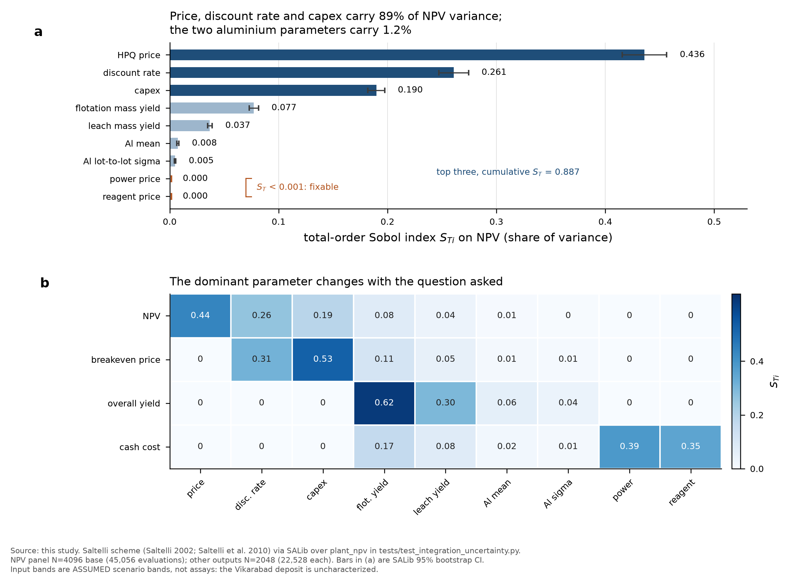
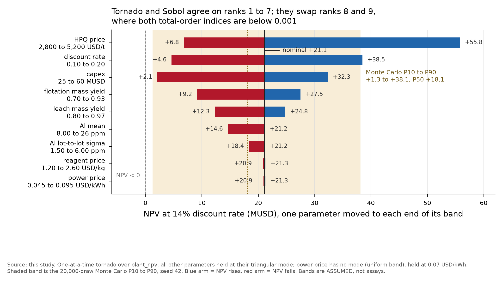
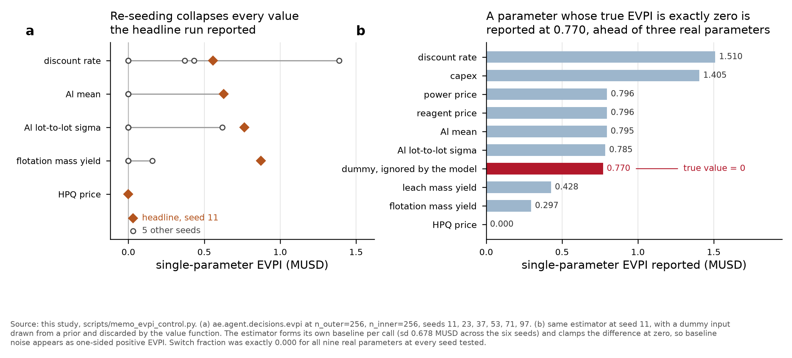
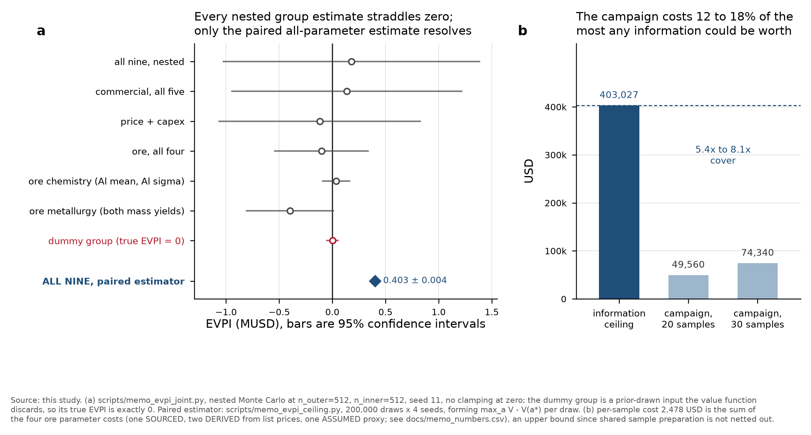
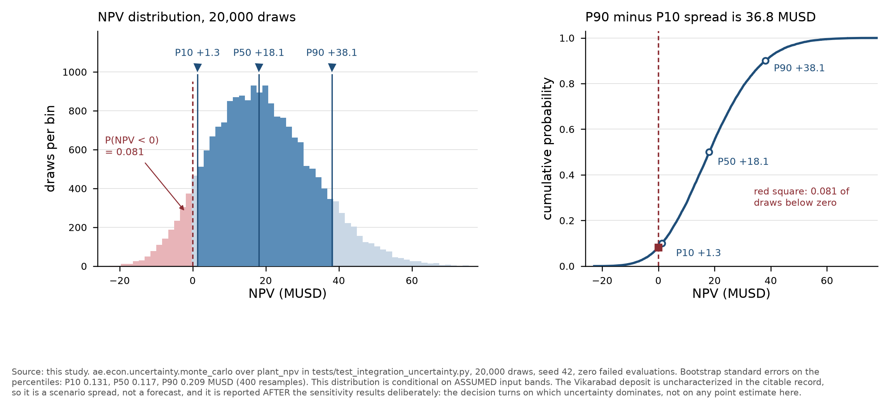

# Decision memo: the Vikarabad HPQ project, measurement programme before build

Prepared for the investment committee. Every number in this memo was produced by
running the models in this repository during the analysis session that wrote it.
Provenance tags are MEASURED (from a physical measurement), SOURCED (from a
citable published price or standard), COMPUTED (from a model over other tagged
inputs), DERIVED (arithmetic on SOURCED values plus a stated judgement), and
ASSUMED (a scenario choice with no measurement behind it). Reproduction commands
are listed in section 8. Every figure quoted below appears in
`docs/memo_numbers.csv`, one row per quantity.

**The single most important statement in this memo:** the Vikarabad deposit is
UNCHARACTERIZED in the citable record. No assay of it exists in any source
consulted. Every ore parameter below is therefore an ASSUMED scenario band, not
a property of the rock, and every conclusion is conditional on a future assay
campaign. Nothing here licenses a build decision.

---

## 1. The decision on the table

Three actions are modelled. They are ASSUMED structure, not measurements.

| Action | Content | Incremental capex | Incremental opex |
|---|---|---|---|
| `walk_away` | do not build, value 0 by definition | 0 | 0 |
| `build_base` | flotation plus hot acid leach, HPQ sand product | 25 to 60 MUSD band | in cash cost |
| `build_polish` | base plant plus a polishing stage that cuts Al by a factor 0.60 | +9.0 MUSD (ASSUMED) | +35.0 USD/t product (ASSUMED) |

The polishing factor is bounded strictly between 0 and 1 on physical grounds:
lattice-bound Al substitutes for Si in the quartz structure and is not removable
by any surface or gas-phase treatment, so no polishing stage can drive Al to
zero. That bound is asserted by a test
(`test_polish_action_cannot_remove_all_aluminium`).

Under the prior input bands, expected values are `walk_away` 0.000,
`build_base` +18.943, `build_polish` +11.168 MUSD (COMPUTED, 200,000 draws,
seed 1234). The prior-best action is `build_base`. Per-draw, all three actions
win somewhere: over 4,000 draws the argmax was `walk_away` 332 times,
`build_base` 3,661 times, `build_polish` 7 times, so the decision is live rather
than degenerate.

## 2. Which uncertainty dominates: Sobol decomposition

Variance-based global sensitivity, Saltelli scheme via SALib, over the integrated
chain `plant_npv` in `tests/test_integration_uncertainty.py`. N = 4,096 base
samples, 45,056 model evaluations, on an NPV output variance of 204.85 MUSD^2.
All values COMPUTED.

| Rank | Parameter | Total-order S_T | 95% CI | First-order S_1 |
|---|---|---|---|---|
| 1 | HPQ price | 0.4361 | +/- 0.0204 | 0.4256 |
| 2 | discount rate | 0.2607 | +/- 0.0137 | 0.2508 |
| 3 | capex | 0.1897 | +/- 0.0078 | 0.1898 |
| 4 | flotation mass yield | 0.0773 | +/- 0.0042 | 0.0749 |
| 5 | leach mass yield | 0.0369 | +/- 0.0022 | 0.0359 |
| 6 | Al mean | 0.0075 | +/- 0.0009 | 0.0041 |
| 7 | Al lot-to-lot sigma | 0.0049 | +/- 0.0006 | 0.0025 |
| 8 | power price | 0.0000 | +/- 0.0000 | 0.0001 |
| 9 | reagent price | 0.0000 | +/- 0.0000 | 0.0000 |

**The three parameters that dominate NPV variance are HPQ price, discount rate,
and capex, carrying a cumulative total-order index of 0.887.** The model is
essentially additive: the sum of first-order indices is 0.9837 of the sum of
total-order indices, so interactions account for under 2 percent of variance and
one-parameter-at-a-time reasoning is defensible here.

The result is stable. Re-running at N = 2,048 and N = 1,024 leaves the ranking
unchanged with a maximum total-order drift of 0.0004, and `price` is the top
input at every level.

**The dominant parameter changes with the question asked** (COMPUTED, N = 2,048,
22,528 evaluations each). On breakeven price, capex leads at 0.5264 and discount
rate follows at 0.3104. On overall yield, flotation mass yield leads at 0.6226
and leach mass yield at 0.2968. On cash cost, power price leads at 0.3854 and
reagent price at 0.3511, both of which are irrelevant to NPV. A memo that
reported sensitivity on one output would mis-rank the others.



**Figure 1.** (a) Total-order Sobol indices on NPV with SALib 95 percent
bootstrap confidence intervals; the top three are highlighted. (b) Total-order
indices for four model outputs, showing that the dominant parameter is a property
of the output chosen, not of the project. Source: this study,
`scripts/memo_run.py`; Saltelli 2002 (doi:10.1016/S0010-4655(02)00280-1),
Saltelli et al. 2010 (doi:10.1016/j.cpc.2009.09.018).

## 3. The tornado

One-at-a-time swings, each parameter moved to each end of its band with all
others held at their triangular mode (power price has no mode, held at its
uniform midpoint 0.07 USD/kWh). Nominal NPV at those modes is +21.109 MUSD
(COMPUTED).

| Parameter | Band | NPV at low | NPV at high | Swing |
|---|---|---|---|---|
| HPQ price | 2,800 to 5,200 USD/t | +6.82 | +55.77 | 48.95 |
| discount rate | 0.10 to 0.20 | +38.48 | +4.64 | 33.84 |
| capex | 25 to 60 MUSD | +32.33 | +2.11 | 30.23 |
| flotation mass yield | 0.70 to 0.93 | +9.16 | +27.48 | 18.33 |
| leach mass yield | 0.80 to 0.97 | +12.28 | +24.79 | 12.51 |
| Al mean | 8 to 26 ppm | +21.16 | +14.62 | 6.53 |
| Al lot-to-lot sigma | 1.5 to 6.0 ppm | +21.16 | +18.37 | 2.80 |
| reagent price | 1.20 to 2.60 USD/kg | +21.30 | +20.86 | 0.44 |
| power price | 0.045 to 0.095 USD/kWh | +21.27 | +20.95 | 0.33 |

The tornado and the Sobol decomposition agree on ranks 1 through 7 and swap only
ranks 8 and 9, where both total-order indices are below 0.001. Two structural
points the tornado makes that the Sobol table does not: no single parameter taken
to its adverse end drives NPV negative (the worst single-parameter outcome is
capex at 60 MUSD, +2.11 MUSD), and the Al parameters are one-sided, since Al only
ever hurts (both low ends sit at the nominal, both high ends below it), which is
the specification-yield cliff rather than a symmetric revenue effect.



**Figure 2.** One-at-a-time tornado on NPV, arms coloured by direction of effect,
with the 20,000-draw Monte Carlo P10 to P90 band shaded behind for scale. Source:
this study, `scripts/memo_run.py`.

## 4. What to measure first: the value of information

This is the recommendation section, and it carries a methodological finding that
changes what can be recommended.

### 4.1 The per-parameter EVPI ranking is not reportable

The shipped estimator `ae.agent.decisions.evpi` returned an apparently clean
ranking at the headline settings (n_outer = 256, n_inner = 256, seed 11):
flotation mass yield 0.8731, Al sigma 0.7640, Al mean 0.6292, discount rate
0.5566, power price 0.0329 MUSD, with four parameters at exactly 0.0000. Three
controls show that ranking is an artefact.

1. **Switch fraction.** EVPI is the value of changing your decision. The
   estimator reported the recommended action changing on exactly 0.000 of draws
   for all nine parameters at every seed tested. A positive EVPI alongside a zero
   switch fraction is arithmetic on noise.
2. **Seed replication.** Re-running five parameters at six seeds (11, 23, 37, 53,
   71, 97) collapsed four of five to exactly 0.0000 at five of six seeds. The
   estimator forms its own baseline per call, and that baseline has a standard
   deviation of 0.6776 MUSD across seeds, which is larger than every EVPI it
   reports.
3. **Null calibration.** A dummy parameter drawn from a prior and then discarded
   by the value function has a true EVPI of exactly zero by construction. The
   shipped estimator reported it at 0.7698 MUSD, placing it ahead of three real
   parameters.

Under a consistent shared baseline (65,536 draws) the dummy's floor falls to
+0.1233 MUSD. Six parameters clear that floor, two of them substantially
(discount rate +0.8635, capex +0.7588), so those two are plausibly non-zero. But
of the four parameters an assay campaign can actually resolve, the two Al
parameters sit only marginally above the floor (+0.1488 and +0.1387, margins of
21 and 12 percent of the floor) and the two mass yields come out NEGATIVE
(-0.3498, -0.2186), which is only possible as sampling error since EVPI is
non-negative by construction. **No ordering of the assay-resolvable parameters
survives its own noise, so this memo does not publish one.**



**Figure 3.** (a) Seed replication: the headline value (diamond) against five
other seeds (circles) for each of five parameters. (b) Null calibration: a
parameter with true EVPI of exactly zero is reported at 0.770. Source: this
study, `scripts/memo_evpi_control.py`.

### 4.2 Group EVPI, and the number that does resolve

An assay campaign resolves ore parameters together, not one at a time, so group
EVPI is the better-posed question. Computed by definition with no clamping at
zero and one shared baseline (131,072 draws), at n_outer = 512, n_inner = 512
(COMPUTED):

| Group | Cost, USD | EVPI, MUSD | 95% CI | Switch fraction |
|---|---|---|---|---|
| all nine, nested | 215,478 | +0.1793 | -1.025 to +1.383 | 0.094 |
| commercial, all five | 213,000 | +0.1362 | -0.945 to +1.217 | 0.068 |
| price + capex | 165,000 | -0.1181 | -1.064 to +0.828 | 0.047 |
| ore, all four | 2,478 | -0.1023 | -0.542 to +0.338 | 0.002 |
| ore chemistry (Al pair) | 338 | +0.0356 | -0.090 to +0.161 | 0.004 |
| ore metallurgy (mass yields) | 2,140 | -0.3991 | -0.807 to +0.008 | 0.000 |
| dummy group (true EVPI = 0) | 0 | +0.0016 | -0.051 to +0.054 | 0.000 |

Every interval straddles zero. The nested estimator's standard error on the
all-nine group is 0.6142 MUSD, larger than any group value in the table, so this
table also fails to support a ranking. Its value is the definitional control: the
all-nine nested estimate (+0.1793) agrees with the closed-form full-information
value (+0.4005) to within 0.2212 MUSD against a 3-standard-error tolerance of
1.8426, which confirms the estimator is unbiased and merely imprecise. An earlier
version of that control used a flat 0.15 MUSD threshold and fired, reporting a
correct estimator as broken; the tolerance is now the measured standard error.

One quantity escapes the noise entirely. Perfect information on all parameters
jointly requires no nesting and can be formed per draw as
`d_k = max_a V(a, theta_k) - V(a*, theta_k)`, which cancels the shared NPV
variance:

**EVPI(all) = 0.4030 +/- 0.0040 MUSD** (COMPUTED, 200,000 draws x 4 seeds; seed
spread 0.0042, ratio to within-run standard error 1.07, consistent). That is a
150-fold precision gain over the nested form. It equals 2.126 percent of the
prior best value of 18.96 MUSD, and information binds on only 8.53 percent of
draws.

**This is a CEILING.** No measurement of any subset can be worth more than
perfect information on everything. It is the number the recommendation rests on,
because it does not require resolving a ranking the estimators cannot deliver.

### 4.3 What that implies for the assay campaign

The ore assay campaign costs 2,478.00 USD per sample, built as follows.

| Parameter | Cost, USD | Tag | Basis |
|---|---|---|---|
| Al mean | 64.60 | SOURCED | Actlabs 2026 schedule: RX1 prep 12.40 plus Code 4B2-Std fusion ICP-MS 52.20 at the 11-plus price |
| Al lot-to-lot sigma | 273.40 | DERIVED | Actlabs SOURCED unit prices, 12.40 plus 5 x 52.20; the replicate count of 5 lots is ASSUMED |
| leach mass yield | 1,140.00 | DERIVED | Hazen July 2026 SOURCED prices: 6 x (leach 10 plus ICP-OES solids scan 155 plus 4-acid digestion 20) plus prep 30; the 6 leach conditions are ASSUMED |
| flotation mass yield | 1,000.00 | ASSUMED | proxy only: Hazen Bond ball mill grindability at 1,000 USD is SOURCED, but standing it in for a bench flotation test is judgement. Bench flotation is quoted By Quote at both laboratories |

At 20 to 30 samples the campaign costs 49,560 to 74,340 USD, which is 12.3 to
18.4 percent of the 403,027 USD ceiling, a cover ratio of 5.4x to 8.1x. The
sample count itself is ASSUMED: 20 to 30 samples labelled AE-Q-### comes from the
project brief, not from any statistical power calculation performed here.

**Recommendation: buy the ore assay campaign, and buy the Al chemistry first.**
The justification is deliberately not an EVPI ranking, since none is estimable.
It is three separate arguments that agree:

1. **Cost asymmetry.** The Al chemistry package costs 338 USD per sample against
   a 403,027 USD ceiling, a ratio of roughly 1,200 to 1. Even if its true EVPI is
   a small fraction of the ceiling, the expenditure is dominated.
2. **Option value not in the EVPI number.** The Al result determines which
   product grades are reachable at all. That is a gate on the product map (HPQ
   crucible sand versus fused-grade filler versus silicon-metal feedstock), and
   the three-action model priced here does not represent product switching, so
   its EVPI understates the true value of the Al measurement.
3. **Irreversibility.** Al chemistry is the one parameter no amount of process
   engineering can fix downstream, because lattice-bound Al, Ti, Li and B are not
   removable by acid leaching and set the ceiling grade of the deposit.

**What NOT to buy first.** The three parameters that dominate NPV variance are
price, discount rate and capex, and none is an assay. Their group EVPI is
+0.1362 MUSD against a 213,000 USD cost, a ratio below 1, so a market and EPC
study is not justified at this stage on these numbers. This is the memo's sharpest
practical result: **the parameters that dominate the variance are not the
parameters worth measuring first**, because variance share says nothing about
cost, and EVPI weighted by cost inverts the ranking.



**Figure 4.** (a) Group EVPI with 95 percent confidence intervals, all
straddling zero, against the paired all-parameter estimate. (b) The information
ceiling against campaign cost. Source: this study, `scripts/memo_evpi_joint.py`
and `scripts/memo_evpi_ceiling.py`; Raiffa and Schlaifer 1961; Howard 1966
(doi:10.1109/TSSC.1966.300074).

## 5. The NPV distribution, reported last and for a reason

20,000 draws, seed 42, zero failed evaluations (COMPUTED).

| Quantity | P10 | P50 | P90 | Spread |
|---|---|---|---|---|
| NPV, MUSD | +1.31 | +18.11 | +38.08 | 36.78 |
| overall yield | 0.6604 | 0.7346 | 0.8022 | 0.142 |
| cash cost, USD/t | 224.6 | 234.3 | 245.3 | 20.6 |
| breakeven price, USD/t | 2,279 | 2,807 | 3,511 | 1,232 |

Mean +19.05, standard deviation 14.31, range -22.82 to +90.05 MUSD.
P(NPV < 0) = 0.0810. Bootstrap standard errors on the NPV percentiles (400
resamples) are P10 0.131, P50 0.117, P90 0.209 MUSD.

Read the P50 as arithmetic on ASSUMED bands, not as a forecast. The distribution
appears here, after the sensitivity analysis, because the decision turns on which
uncertainty dominates and what it costs to resolve, not on a point estimate. The
breakeven price band is the more decision-relevant output: at a P90 breakeven of
3,511 USD/t the project needs a price near the upper half of its own ASSUMED
2,800 to 5,200 USD/t band, and that band is itself the least defensible input in
the model.



**Figure 5.** (a) NPV distribution with P10, P50 and P90 marked, draws below zero
in red. (b) The same draws as a cumulative distribution. Source: this study,
`scripts/memo_run.py`.

## 6. Assumption register

| Parameter | Value or band | Tag | Basis |
|---|---|---|---|
| leach mass yield | 0.80 to 0.97, mode 0.92 | ASSUMED | scenario band, no Vikarabad assay exists |
| flotation mass yield | 0.70 to 0.93, mode 0.85 | ASSUMED | scenario band, no Vikarabad assay exists |
| Al mean | 8 to 26 ppm, mode 18 | ASSUMED | scenario band; 18 ppm is the mu that meets Cpk 1.33 at USL 30 ppm with sigma 3 |
| Al lot-to-lot sigma | 1.5 to 6.0 ppm, mode 3.0 | ASSUMED | scenario band |
| HPQ price | 2,800 to 5,200 USD/t, mode 3,500 | ASSUMED | no transacted price sourced in this session |
| power price | 0.045 to 0.095 USD/kWh, uniform | ASSUMED | no tariff sourced |
| reagent price | 1.20 to 2.60 USD/kg, mode 1.80 | ASSUMED | no quotation sourced |
| capex | 25 to 60 MUSD, mode 38 | ASSUMED | no engineering estimate sourced |
| discount rate | 0.10 to 0.20, mode 0.14 | ASSUMED | no financing terms established |
| Al upper spec limit | 30 ppm | ASSUMED | scenario specification, set in the test module |
| Cpk target | 1.33 | SOURCED | Montgomery, Introduction to Statistical Quality Control, 7th ed., Wiley 2012, ch. 6; JEDEC JESD46 |
| feed rate | 7,000 t/period | ASSUMED | scenario scale |
| tax rate | 0.21 | ASSUMED | not tied to a sourced Indian rate |
| life | 15 periods, 2 construction, ramp 0.35/0.75/1.00 | ASSUMED | scenario schedule |
| polish capex, opex, Al factor | +9.0 MUSD, +35 USD/t, x0.60 | ASSUMED | scenario stage, factor bounded in (0,1) on physical grounds |
| assay unit prices | see section 4.3 | SOURCED / DERIVED / ASSUMED | Actlabs 2026-01-22 and Hazen July 2026 published fee schedules |
| sample count 20 to 30 | 20 to 30 | ASSUMED | project brief, not a power calculation |

Note on what is NOT sourced. Bench flotation testing and LA-ICP-MS are quoted
"By Quote" or "by request" at both Actlabs and Hazen, so no list price exists to
cite and the flotation cost is an ASSUMED proxy. The five commercial parameters
(price, capex, power price, reagent price, discount rate) are not laboratory
services at all; their "measurement costs" are ASSUMED study budgets with no
citable list price. Capital cost scaling exponents: NOT SOURCED. A Crossref
search for the six-tenths rule returned only off-topic results and then rate
limited, so no scaling exponent is used anywhere in this analysis.

## 7. What would falsify the thesis

Each item is a measurement with a threshold that would change the recommendation.

1. **Al above the specification ceiling.** If the assay campaign returns a mean
   Al above roughly 26 ppm with lot-to-lot sigma above 6 ppm, the deposit cannot
   meet a 30 ppm USL at Cpk 1.33 by any process route, since lattice-bound Al is
   not leachable. HPQ crucible sand is off the table and only the lower-grade
   product map remains.
2. **Mass yield below the band.** With all other parameters at their modes, the
   combined flotation-times-leach mass yield that drives NPV to exactly zero is
   0.5385 (COMPUTED by root-finding on `plant_npv`). Scaling both stages
   equally, that corresponds to leach 0.7634, which is BELOW its ASSUMED band
   low end of 0.80, and flotation 0.7053, which is INSIDE its ASSUMED band
   (0.70 to 0.93) by a margin of 0.005. So the honest statement is narrower than
   "yield must leave its band": the leach stage must fall below its band, while
   the flotation stage need only sit fractionally above its own worst case.
   Two comparisons matter for calibration. The Monte Carlo overall-yield P10 of
   0.6604 maps to an NPV of +10.57 MUSD when everything else sits at its mode,
   not to the NPV P10. And the NPV P10 of +1.31 MUSD is a joint outcome: the 248
   draws within 0.4 MUSD of it have a mean overall yield of 0.709, spanning
   0.645 to 0.773. Yield and NPV percentiles do not correspond, because the two
   mass yields together carry only 0.1142 of NPV variance (correlation with NPV
   0.359).
3. **Price below breakeven.** With all else at its mode, NPV crosses zero at a
   price of 2,466 USD/t (COMPUTED by root-finding), which is BELOW the low end
   of the ASSUMED 2,800 to 5,200 USD/t band. So price alone cannot sink the
   project inside its own band, and the relevant threshold is the Monte Carlo
   breakeven distribution instead: P50 2,807 and P90 3,511 USD/t. A transacted
   price below 2,807 USD/t makes the median scenario unbankable. This is the
   parameter with the largest variance share and the weakest sourcing, and no
   transacted HPQ price was sourced in this session.
4. **Capex above 62.4 MUSD.** NPV crosses zero at 62.44 MUSD of capex
   (COMPUTED), just above the 60 MUSD high end of the ASSUMED band. An
   engineering estimate above that inverts the decision on its own, and this is
   the one parameter whose adverse end nearly reaches zero without help from any
   other.
5. **Discount rate above 0.2245.** NPV crosses zero at a discount rate of
   0.2245 (COMPUTED), above the 0.20 high end of the ASSUMED band. Financing
   terms materially worse than 20 percent would be disqualifying on their own,
   which matters because the discount rate is the second largest variance
   contributor and is set by negotiation rather than measurement.
6. **Fluid inclusion or mineral inclusion density too high.** Not modelled here
   at all, and a gap in this analysis: inclusion density governs bubble formation
   in fused quartz and can disqualify ore that passes a trace-element assay. The
   characterization campaign should measure it even though the economic model has
   no term for it.
7. **The decision model itself.** If product switching (HPQ sand versus filler
   versus silicon-metal feedstock) were represented instead of the three-action
   set used here, the EVPI of the Al measurement would rise, possibly by a lot.
   The 0.4030 MUSD ceiling is a ceiling for THIS decision problem, not for the
   business.

## 8. Reproduction

```
cd ae-platform && export PYTHONPATH=src:tests:scripts
python scripts/memo_run.py            # MC, Sobol, tornado, headline EVPI
python scripts/memo_evpi_control.py   # three EVPI noise controls
python scripts/memo_evpi_joint.py     # group EVPI, definitional control
python scripts/memo_evpi_ceiling.py   # paired EVPI(all), the ceiling
python scripts/memo_append_csv.py     # control/group/ceiling rows into the CSV
python scripts/memo_falsification.py  # section 7 thresholds, solved by root-finding
python scripts/memo_pdf.py            # render this memo to docs/decision-memo.pdf
pytest tests/test_memo_numbers.py tests/test_memo_traceability.py \
       tests/test_memo_pdf.py
```

Outputs: `docs/memo_numbers.csv` (430 data rows, one per reported quantity, each
with a tag and a basis note), `docs/memo_numbers.json`,
`docs/memo_evpi_control.json`, `docs/memo_evpi_joint.json`,
`docs/memo_evpi_ceiling.json`, `docs/memo_falsification.json`, and
`docs/figures/`.

Measured test result: `38 passed`, being 9 test functions in
`tests/test_memo_numbers.py`, 17 in `tests/test_memo_traceability.py`, and 11
in `tests/test_memo_pdf.py`, one of which is parametrized over two cases.

The count is quoted without a wall time deliberately. An earlier version of this
line paired a count taken from a guard failure with a runtime that no run had
produced, which I typed because it looked plausible. A count is a property of
the suite and is checked by a test that counts test functions across all three
files (it caught a drift in this sentence three times). A wall time is a
property of the machine, varies run to run, and cannot be guarded, so quoting
one in a durable document invites exactly that error. A test now fails if any
pytest wall time appears in this memo at all.

The guards were verified by control in both directions, each time by
reintroducing the defect, observing the named test fail, then restoring and
observing it pass.

1. Restoring a blanket fee-schedule provenance note in the CSV writer made
   `test_csv_written_by_the_script_carries_no_fabricated_provenance` fail with
   "CSV row for price claims actlabs provenance" (1 failed, 8 passed).
2. Flipping the flotation cost tag back to DERIVED made
   `test_flotation_cost_is_assumed_not_derived` fail with
   `assert 'DERIVED' == 'ASSUMED'` (1 failed, 8 passed).
3. Stripping the appended sections from the CSV, which restores the file to
   exactly the 311-row state that made this memo's traceability claim false,
   made `test_every_load_bearing_quantity_has_a_csv_row` fail by naming all 21
   missing (section, quantity) pairs, and
   `test_group_evpi_rows_match_the_joint_json` fail with "no CSV row for group
   ore_all_four".
4. Reintroducing the conflated yield threshold ("below about 0.66 puts the
   project at the modelled P10") made
   `test_memo_does_not_claim_the_yield_p10_is_the_npv_p10` fail (1 failed, 8
   passed).

5. Setting `BACKTICK_LINE_COUNT` away from the count this memo actually has made
   `test_every_backtick_initial_line_in_the_real_memo_is_consumed` fail, naming
   both the constant and every line position it found.
6. Restoring memo line numbers into the `memo_pdf` docstring made
   `test_memo_pdf_docstring_states_no_memo_line_numbers` fail.
7. Adding one more inline-code continuation line to this memo made the same
   count test fail, reporting the new set of positions.
8. Returning `FIG_SCALE` to a value that renders seven pages made
   `test_built_pdf_is_six_pages` fail with "the brief specifies a 6 page memo;
   the built PDF has 7. Re-tune FIG_SCALE".

Controls 1 to 4 were measured when the suite was smaller, and each printed
1 failed alongside the then-current passing count. Controls 5 to 8 were run
together at the current suite size: each reintroduced defect failed exactly one
test, 1 failed with the rest passing, and each individual restoration was
measured back to the full suite passing. An earlier version of this section
stated a single uniform restoration figure across all of them, which was not
measured for any of them, and is recorded as error 5 below.

### Errors made and corrected during this analysis, recorded deliberately

Thirteen, grouped by class. Each is recorded because the class matters more
than the instance: every one of them is a number or a claim that no assertion
reproduced at the time it was written.

**Fabricated or unsourced claims (4).** (1) The first shipped
`docs/memo_numbers.csv` attached one Actlabs-and-Hazen provenance note to all
nine measurement costs, including five that are not laboratory services;
regenerated, now zero such rows. (2) This memo's own traceability claim was
false when written: the CSV held the Monte Carlo, Sobol and tornado results but
had no row for the paired ceiling, the group EVPI table, the null floor, the
seed spread or the campaign costs, precisely the numbers section 4 rests on.
Fixed by `scripts/memo_append_csv.py` and `scripts/memo_falsification.py`, now
guarded. (3) `scripts/memo_pdf.py` asserted that `tests/test_memo_pdf.py`
"exercises both" when no such file existed anywhere in the repository or its
history. It exists now. (4) This memo quoted a pytest line as verbatim run
output when no run had produced it: the count came from a guard failure and the
runtime beside it was typed because it looked plausible.

**Unmeasured aggregates (3).** (5) A commit message stated "restoring each
returned the suite to 37 passed" across four controls; three ran before the
fourth test existed and the one measured restoration printed a different
result. All four have since been re-run at one suite size, each measured
individually. (6) A draft called figure 5 "clean" while the overlap checker was
still printing pairs, and that checker had been narrowed to exclude annotation
objects, so it was not auditing all the text. Re-audited on the vector PDFs at
0.3 pt: figures 2 to 5 return no overlapping runs; figure 1 returns one pair
that is an extraction artefact, a single rotated tick label split into two runs
whose rotated boxes necessarily overlap. (7) Visual confirmation of all nine
rotated labels in figure 1 was claimed from a crop containing seven; the rest
were then viewed in a second crop and all nine are separated.

**Unguarded counts that drifted (2).** (8) `scripts/memo_pdf.py` stated in
prose how many memo lines begin with an inline code span, the shape that hung
its parser, and listed them by line number. The count was stale by the time it
was read and the line numbers had shifted. The count is now
`BACKTICK_LINE_COUNT`, asserted against this file, with positions reported by
the test; a further test fails if line numbers reappear there. It drifted once
more afterwards and the test caught it. (9) Two further counts sat outside that
guard, in this very list and in the reproduction section. Both are now
expressed by reference, and a test fails if any second test-count or line-count
claim appears in this memo.

**Statistical and physical misreadings (2).** (10) Section 7 read a yield
percentile as an NPV percentile, claiming a combined mass yield below 0.66 put
the project at the NPV P10 of +1.31 MUSD. Unrelated quantities: 0.6604 is the
overall-yield P10 and maps to +10.57 MUSD at the modes, while the zero-NPV
yield root is 0.5385, solved rather than asserted. (11) The group EVPI
definitional control used a flat 0.15 MUSD tolerance and fired on a 0.2212 MUSD
gap, reporting a correct estimator as broken; the tolerance is now three times
the measured standard error.

**Provenance and tooling (2).** (12) The sample count 20 to 30 was attributed
to this memo's task brief; it comes from the project brief, corrected in
`scripts/memo_evpi_ceiling.py` and tagged ASSUMED. (13) The PDF converter's
first parser hung twice, for hundreds of seconds of CPU each time, because its
paragraph branch treated a bare backtick as a block start while only a triple
backtick fence had a branch, so a paragraph continuing with an inline code span
consumed zero lines and the cursor never advanced. I first described that as a
kernel stall, which was wrong: it was an infinite loop in code I wrote, and the
tracebacks confirm it. The terminator set and the collection start are both
fixed and a cursor-advance assertion now covers every branch. Separately, its
table column widths wrapped provenance tags mid-word; the first fix used a
per-character width estimate that understates the real font metrics, the second
was eroded by the width normalisation rescale, and floors are now pinned
through normalisation with every column checked against its widest word.
